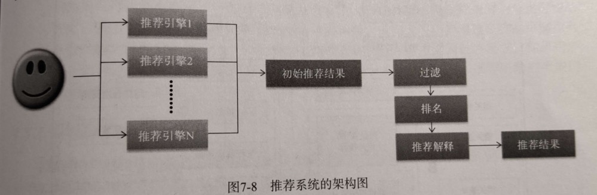

# 机器学习

# 推荐算法

https://www.liaojiayi.com/recommendations/

# Flink CEP
https://github.com/haoch/flink-siddhi
A CEP library to run Siddhi within Apache Flink™ Streaming Application
https://www.liaojiayi.com/flink-IoT/

# 数据库管理工具
官方网站：https://slashbase.com/
开源项目：https://github.com/slashbaseide/slashbase
试用地址：https://demo.slashbase.com/

https://blog.csdn.net/weixin_50296887/article/details/129304320
https://blog.csdn.net/jiandanbuguo/article/details/109385364
https://blog.csdn.net/zhi___you/article/details/120777096

# 推荐算法
# 推荐算法
# 推荐算法
